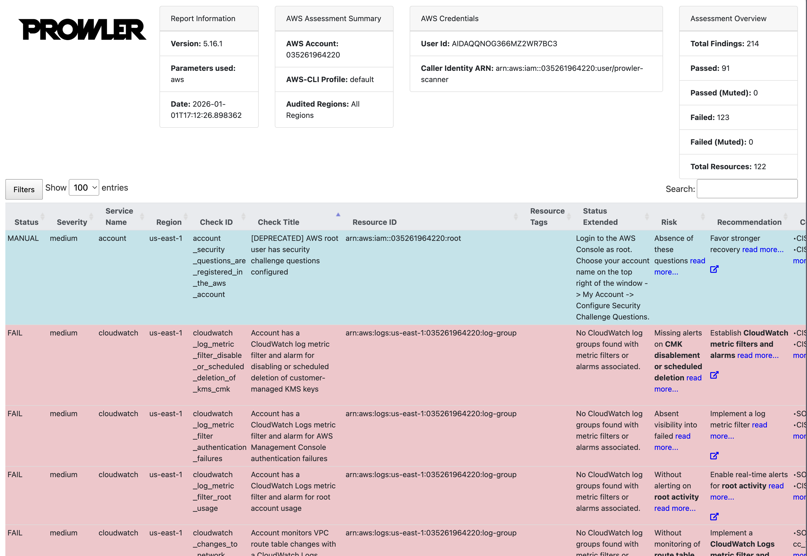

# AWS CIS Compliance Monitor

Automated security assessment tool that scans AWS infrastructure against CIS AWS Foundations Benchmark using Prowler.



## 🎯 Overview

This project automates AWS security compliance scanning across 80+ services including EC2, S3, IAM, CloudTrail, and VPC. It identifies misconfigurations, security gaps, and generates detailed compliance reports.

**Key Features:**
- 576 automated security checks
- CIS AWS Foundations Benchmark compliance
- HTML/JSON/CSV report generation
- Critical, High, Medium, Low severity prioritization

## 🛠️ Tech Stack

- **Prowler 4.6** - Open-source AWS security tool
- **Python 3** - Automation scripting  
- **Boto3** - AWS SDK for Python
- **AWS CLI** - Command-line AWS interaction

## 🚀 Quick Start

### Prerequisites
- AWS Free Tier account
- Python 3.8+
- AWS CLI

### Installation
```bash

